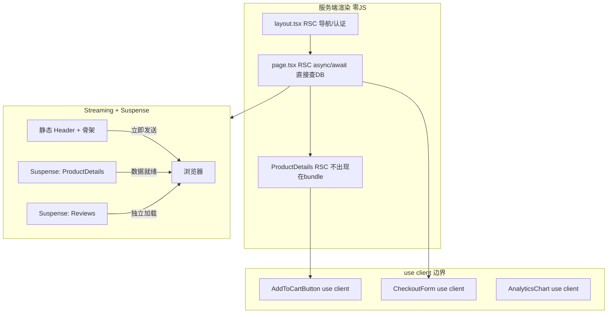

# Next.js App Router 架构深度

> App Router（Next.js 13+）与 Pages Router 的本质区别：React Server Components + 四层缓存。
> 考察点：RSC 边界、Server Actions、缓存层次、Streaming、Partial Prerendering。

---

## 面试框架（45分钟怎么答）

**第一步（开场）**：说清 App Router 最大变化——默认 Server Component（零客户端 JS）；只有 `use client` 标注的才下发到浏览器；这和 Pages Router 的"客户端优先"是相反的
**第二步（核心）**：RSC vs Client Component 边界决策；四层缓存（Request Memoization / Data Cache / Full Route Cache / Router Cache）的各自作用和失效方式；Server Actions 替代 API Route 的场景
**第三步（深挖）**：Streaming + Suspense 分段输出 HTML（先送 Header 再等 API 数据）；PPR（Partial Prerendering）静态壳 + 动态孔洞；revalidateTag 跨路由精确缓存失效
**差异化得分点**：能说出 "RSC 不能用 useState/useEffect/浏览器 API"；能画出组件树中 Server/Client 边界的决策（尽量把 `use client` 下推到叶节点）

---

## 架构图：App Router RSC 组件树边界



---

## Pages Router vs App Router 核心区别

```
Pages Router                      App Router
──────────────────────────────    ──────────────────────────
getServerSideProps / getStaticProps  →  async Server Component
getStaticPaths                    →  generateStaticParams
API Routes                        →  Route Handlers + Server Actions
_app.tsx / _document.tsx          →  layout.tsx（可嵌套）
无流式渲染                        →  Streaming + Suspense
客户端导航时全量组件渲染           →  Partial Hydration（只有 Client Components）
```

---

## React Server Components（RSC）

```
RSC 的核心：组件在服务端运行，HTML 直接发送到客户端，JS bundle 中无该组件代码。

Server Component（默认）          Client Component（'use client'）
────────────────────────────      ────────────────────────────
可以直接 await fetch/DB            可以用 useState/useEffect
不可以用 onClick/useState          可以绑定事件处理
不发送 JS 到客户端                 JS 发送到客户端并 hydrate
可以 import Client Component       不可以 import Server Component
                                   （但可以通过 children 接收）
```

```typescript
// app/users/page.tsx —— Server Component（默认）
// 直接 await，无需 useEffect + useState
export default async function UsersPage() {
  // 在服务端直接查询数据库（无需 API 层）
  const users = await db.user.findMany({ take: 10 });

  return (
    <div>
      <h1>Users</h1>
      {/* 传递数据给 Client Component */}
      <UserList initialUsers={users} />
      {/* Server Component 可以嵌套 Client Component */}
      <AddUserButton />
    </div>
  );
}

// components/UserList.tsx —— Client Component
'use client';
import { useState } from 'react';

export function UserList({ initialUsers }: { initialUsers: User[] }) {
  const [users, setUsers] = useState(initialUsers);
  // 可以用 useState、事件处理等
  return <ul>{users.map(u => <li key={u.id}>{u.name}</li>)}</ul>;
}

// 错误模式：Server Component 不能用 hooks
// 正确模式：Server Component 传递序列化数据给 Client Component
```

---

## 四层缓存系统

```
请求链路：
  用户请求
      ↓
  Router Cache（客户端内存，Navigation 缓存）
      ↓ miss
  Full Route Cache（服务端 HTML + RSC Payload 缓存）
      ↓ miss
  Data Cache（fetch 级别缓存，Next.js 扩展的 fetch）
      ↓ miss
  Request Memoization（同一请求周期内的去重）
      ↓
  数据源（DB / API）
```

```typescript
// 1. Request Memoization（自动，单次请求周期内去重）
// 同一个渲染周期内，相同 URL 的 fetch 只执行一次
// 不需要手动处理，React 的 cache() 实现

async function getUser(id: string) {
  const res = await fetch(`/api/users/${id}`);  // 即使调用 10 次，只发一个请求
  return res.json();
}

// 2. Data Cache（持久化，跨请求）
async function getProduct(id: string) {
  // 默认缓存，等同于 force-cache
  const res = await fetch(`https://api.example.com/products/${id}`);

  // 永不过期（直到手动 revalidate）
  const res = await fetch(url, { cache: 'force-cache' });

  // 不缓存（每次请求都新鲜数据）
  const res = await fetch(url, { cache: 'no-store' });

  // 时间基础缓存（ISR 风格，60秒后重新验证）
  const res = await fetch(url, { next: { revalidate: 60 } });

  // 标签基础缓存（按需 revalidate）
  const res = await fetch(url, { next: { tags: ['product', `product-${id}`] } });
}

// 3. Full Route Cache（服务端，静态路由的 HTML）
// 静态路由（无动态数据）自动缓存完整 HTML
// 以下操作会退出静态缓存：
// - 使用 cookies()/headers()
// - 使用 searchParams
// - 使用 noStore() 或 cache: 'no-store'

// 4. Router Cache（客户端内存）
// 导航时缓存已访问路由的 RSC Payload
// 默认缓存 30s（动态路由）/ 5min（静态路由）
// router.refresh() 清除当前路由缓存

// 按需清除缓存（Server Action 中）
import { revalidateTag, revalidatePath } from 'next/cache';

async function updateProduct(id: string, data: Partial<Product>) {
  await db.product.update({ where: { id }, data });
  revalidateTag(`product-${id}`);  // 清除该 product 的所有缓存
  revalidatePath('/products');     // 清除 /products 路由缓存
}
```

---

## Server Actions

```typescript
// app/actions/user.actions.ts
'use server';  // 标记为 Server Action（在服务端执行的函数）

import { z } from 'zod';
import { revalidatePath } from 'next/cache';
import { redirect } from 'next/navigation';

const createUserSchema = z.object({
  name: z.string().min(1),
  email: z.string().email(),
});

// Server Action 可以直接在 Client Component 中调用
// Next.js 自动生成 API 端点，无需手动写路由
export async function createUser(formData: FormData) {
  const input = createUserSchema.safeParse({
    name: formData.get('name'),
    email: formData.get('email'),
  });

  if (!input.success) {
    return { error: input.error.flatten().fieldErrors };
  }

  try {
    await db.user.create({ data: input.data });
    revalidatePath('/users');  // 刷新列表
    redirect('/users');         // 重定向（抛出特殊 Error，被 Next.js 捕获）
  } catch (err) {
    if (isRedirectError(err)) throw err;  // redirect() 的错误必须重新抛出
    return { error: 'Failed to create user' };
  }
}

// Client Component 中使用 Server Action
'use client';
import { useFormState, useFormStatus } from 'react-dom';
import { createUser } from '../actions/user.actions';

function CreateUserForm() {
  const [state, formAction] = useFormState(createUser, null);
  const { pending } = useFormStatus();

  return (
    <form action={formAction}>
      <input name="name" />
      <input name="email" type="email" />
      {state?.error && <p>{JSON.stringify(state.error)}</p>}
      <button type="submit" disabled={pending}>
        {pending ? 'Creating...' : 'Create'}
      </button>
    </form>
  );
}
```

---

## Streaming + Suspense

```typescript
// app/dashboard/page.tsx —— 流式渲染
import { Suspense } from 'react';

// 慢组件（如数据库查询）用 Suspense 包裹
// Next.js 会先发送 HTML 骨架，等数据准备好后流式注入
export default function DashboardPage() {
  return (
    <div>
      <h1>Dashboard</h1>

      {/* 立即渲染（快速内容） */}
      <StaticHeader />

      {/* 流式渲染（慢查询，不阻塞页面） */}
      <Suspense fallback={<Skeleton />}>
        <SlowMetrics />    {/* 内部 await 数据库查询 */}
      </Suspense>

      <Suspense fallback={<Skeleton />}>
        <RecentOrders />   {/* 另一个慢查询，并行加载 */}
      </Suspense>
    </div>
  );
}

// 慢组件
async function SlowMetrics() {
  const metrics = await db.metrics.findMany();  // 可能需要 500ms
  return <MetricsChart data={metrics} />;
}
```

---

## 路由系统（文件约定）

```
app/
├── layout.tsx           根 Layout（持久化，切换路由不重建）
├── page.tsx             / 首页
├── loading.tsx          Suspense 骨架（自动包裹 page）
├── error.tsx            错误边界（'use client'）
├── not-found.tsx        404 页面
├── (marketing)/         路由组（不影响 URL，只做 Layout 分组）
│   ├── layout.tsx
│   └── about/page.tsx   /about
├── users/
│   ├── page.tsx         /users
│   └── [id]/
│       ├── page.tsx     /users/123
│       └── edit/page.tsx /users/123/edit
├── api/
│   └── users/
│       └── route.ts     GET/POST /api/users（Route Handler）
└── @modal/              Parallel Routes（同时显示多个页面）
    └── photo/[id]/page.tsx
```

```typescript
// 并行路由（Parallel Routes）—— 模态框保持 URL 的实现
// app/layout.tsx
export default function Layout({
  children,
  modal,  // @modal slot
}: {
  children: React.ReactNode;
  modal: React.ReactNode;
}) {
  return (
    <html>
      <body>
        {children}
        {modal}  {/* 模态框在路由层级，有自己的历史记录 */}
      </body>
    </html>
  );
}

// 拦截路由（Intercepting Routes）
// app/(.)photo/[id]/page.tsx —— 拦截 /photo/123 显示模态框
// app/photo/[id]/page.tsx    —— 直接访问 /photo/123 显示完整页面
```

---

## Partial Prerendering（PPR，实验性）

```typescript
// 同一路由中混合静态和动态内容
// 静态部分立即发送（CDN 缓存），动态部分流式补充

export const experimental_ppr = true;

export default function ProductPage({ params }: { params: { id: string } }) {
  return (
    <div>
      {/* 静态部分：编译时生成，CDN 缓存 */}
      <StaticProductInfo productId={params.id} />

      {/* 动态部分：请求时获取（如库存、个性化价格） */}
      <Suspense fallback={<PriceSkeleton />}>
        <DynamicPrice productId={params.id} />
      </Suspense>
    </div>
  );
}
```

---

## 面试追问

**Q: Server Component 和 Client Component 的边界如何决定？**
A: 从服务端开始，尽量靠近叶子节点才加 `'use client'`。规则：需要交互（onClick、onChange）或需要浏览器 API（localStorage、window）时才用 Client Component；数据获取、访问数据库、用环境变量（服务端）时用 Server Component。交互部分尽量小（只包含按钮/输入框），数据逻辑保留在 Server Component。

## 常见踩坑

**踩坑1：在 Server Component 中使用 useState/useEffect**
❌ 错误：在无 `'use client'` 指令的 Server Component 中写 `useState`，Next.js 报错："useState can only be used in a Client Component"。
✓ 正确：需要状态和副作用的组件加 `'use client'` 指令；数据获取和静态渲染逻辑放 Server Component。
原因：Server Component 在服务器运行，不存在"状态"和"副作用"的概念，这些是客户端 React 的功能。

**踩坑2：`'use client'` 组件中直接 import 大型服务端库**
❌ 错误：Client Component 中 `import { prisma } from '@/lib/db'`，Prisma 被打包进客户端 bundle，泄露数据库凭证和 500KB+ 的 bundle 增量。
✓ 正确：数据库操作只在 Server Component 或 Server Action 中执行，通过 props 将数据传给 Client Component。
原因：`'use client'` 边界内的代码会被打包到发送给浏览器的 JS 中，服务端专用代码绝对不能出现在 Client Component。

**踩坑3：未使用 `revalidateTag` 导致数据更新后用户看到旧内容**
❌ 错误：商品价格更新后，ISR 缓存的商品详情页仍然显示旧价格，用户刷新也没用（因为 Full Route Cache 还有效）。
✓ 正确：在 Server Action（处理价格更新）中调用 `revalidateTag('product-price')`，精确失效相关缓存。
原因：Next.js 的 Data Cache 和 Full Route Cache 默认永久有效，必须主动触发 revalidation 才能更新。

**踩坑4：Server Action 表单提交忘记 CSRF 保护**
❌ 错误：认为 Server Action 自动防 CSRF 而跳过安全检查，实际上在某些配置下第三方页面可以提交到你的 Server Action 端点。
✓ 正确：Next.js 15+ 的 Server Actions 内置了 Origin 验证，但自定义 Action 端点需要手动验证请求来源或使用 CSRF token。
原因：Server Action 本质上是 POST 请求，与普通 API endpoint 面临相同的 CSRF 风险。

**踩坑5：Streaming 中错误边界粒度太粗导致整页降级**
❌ 错误：整个页面只有一个 `<ErrorBoundary>`，任何 Suspense 子树中的数据获取失败都导致整页显示错误状态，用户体验差。
✓ 正确：为每个独立的 Suspense 边界配置独立的 `<ErrorBoundary>`，让其他区域正常显示，只有失败的部分降级。
原因：Streaming + Suspense 的设计目标就是"部分失败不影响整体"，精细的 ErrorBoundary 粒度是实现这一目标的关键。

---

**Q: Next.js 的 Data Cache 和浏览器缓存有什么区别？**
A: Data Cache 是 Next.js 在服务端维护的 fetch 响应缓存（存在服务端文件系统或 Redis），所有用户共享，可以通过 `revalidateTag`/`revalidatePath` 主动清除。浏览器缓存是每个用户独立的，由 HTTP Cache-Control 头控制。两者独立：Data Cache 控制服务端到数据源的请求，Browser Cache 控制浏览器到 Next.js 服务器的请求。

**Q: Server Actions 和 API Routes 什么时候用哪个？**
A: Server Actions 适合表单提交、数据变更（紧密绑定 UI 的操作）；API Routes 适合需要被外部调用（移动端、第三方）、需要精细控制 HTTP 方法/头/状态码的场景。Server Actions 自动处理 CSRF（每次生成 token），API Routes 需要手动处理安全；Server Actions 不暴露 URL，API Routes 有明确的 URL 语义。
